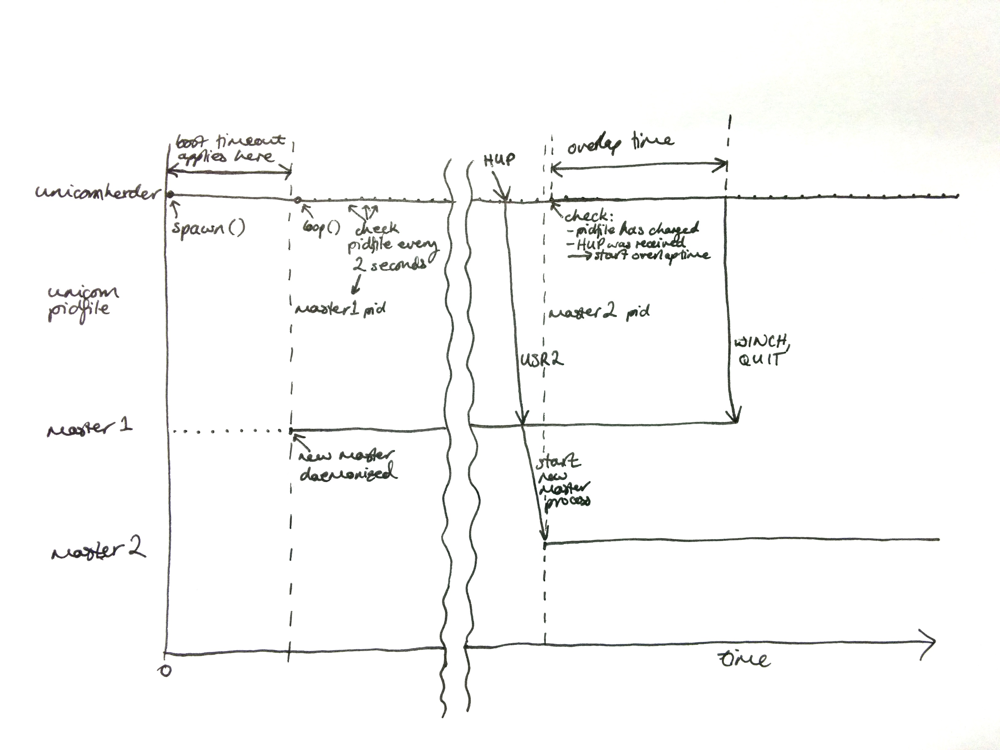

Unicorn Herder
==============

.. image:: https://secure.travis-ci.org/gds-operations/unicornherder.png
   :target: http://travis-ci.org/gds-operations/unicornherder

`Unicorn <http://unicorn.bogomips.org/>`_ and `Gunicorn
<http://gunicorn.org/>`_ are awesome tools for people writing web services in
Ruby and Python. One of the more nifty features of both programs is their
ability to reload application code on-the-fly, by spawning a new master
process (or "arbiter", in Gunicorn's language) in response to an operating
system signal (SIGUSR2). Unfortunately, this reloading process is incompatible
with process-tracking supervisors such as `Upstart
<http://upstart.ubuntu.com/>`_, because the old master process dies as part of
the reload.

Unicorn Herder is a utility designed to assist in the use of Upstart and
similar supervisors with Unicorn. It does this by polling the pidfile written
by the Unicorn master process, and automating the sequence of signals that
must be sent to the master to do a "hot-reload". If Unicorn quits, so will the
Unicorn Herder, meaning that if you supervise the herder (which does not
daemonize), you are effectively supervising the Unicorn process.

Installation
------------

Unicorn Herder is available from the `Python Package Index
<http://pypi.python.org/>`_, and can be installed with `pip
<http://pipinstaller.org/>`_::

    $ pip install unicornherder

Usage
-----

With gunicorn::

    $ unicornherder -- -w 4 myapp:app

With unicorn (using `Bundler <http://gembundler.com>`_)::

    $ bundle exec unicornherder -u unicorn

Signals
-------

Unicorn Herder forwards the following signals to the unicorn master process::

    INT QUIT TERM TTIN TTOU USR1 USR2

Notably, Unicorn Herder does *not* forward ``SIGWINCH``, because it is not
intended to be daemonized.

Unicorn Herder *also* intercepts ``SIGHUP``, because this is the signal sent by
Upstart when you call ``initctl reload``, and uses it to trigger a hot-reload of
its Unicorn instance. This process will take two minutes by default, in order to
give the new workers time to start up.

**NB**: There will be a period during hot-reload when requests are served by
both old and new workers. This might have serious implications if you are
running data migrations between deploying versions of your application. Please
bear this in mind when deciding if you should use Unicorn Herder's
hot-reloading feature.

This diagram shows the interactions between unicornherder and (g)unicorn masters
at boot and around hot-reloading with HUP (ignoring workers):

Upstart config
--------------

An example upstart config (compatible with Upstart v1.4 and later) for use
with Unicorn Herder is given below::

    description "Unicorn Herder"

    start on runlevel [2345]
    stop on runlevel [!2345]

    respawn
    respawn limit 5 20

    env PORT=4567

    setuid www
    setgid www

    chdir /var/apps/myapp

    exec bundle exec unicornherder -u unicorn -- --port $PORT

    # Or, for a gunicorn installation with a virtualenv
    # at /var/venv/myapp...

    #script
    #  . /var/venv/myapp/bin/activate
    #  exec unicornherder -- -w 4 -b "127.0.0.1:$PORT" myapp:app
    #end script

Discussion
----------

You can discuss this tool with our open source mailing list: gds-operations-open-source@digital.cabinet-office.gov.uk

License
-------

Unicorn Herder is released under the MIT license, a copy of which can be found
in ``LICENSE``.
